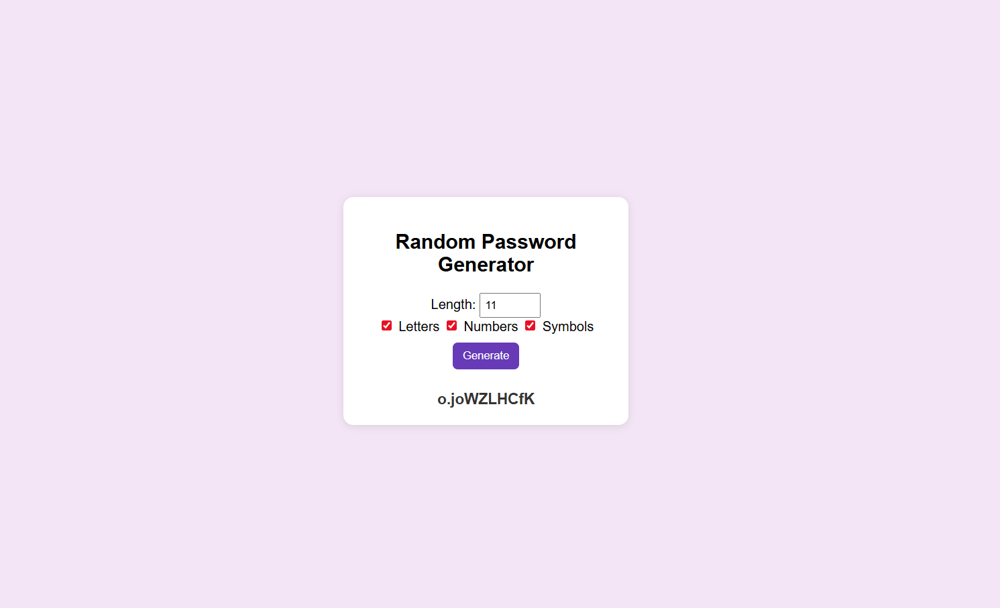
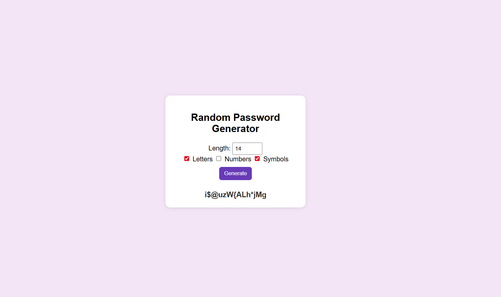

# 🔐 Random Password Generator

A simple yet powerful **Random Password Generator** built using **HTML, CSS, and JavaScript**.  
It helps users to generate strong and secure passwords instantly.

---

## 📸 Project Preview

---

## ✨ Features
- 🎛 Select password length (4–32 characters)
- 🔡 Include / exclude letters
- 🔢 Include / exclude numbers
- 🔣 Include / exclude symbols
- ⚡ Instant random password generation
- 🖥 Clean and responsive UI

---

## 🛠️ Tech Stack
- **HTML5**
- **CSS3**
- **JavaScript (Vanilla)**

---

## 🎯 What I Learned
While building this project, I explored and practiced several important concepts:

- **DOM Manipulation:**  
  Learned how to select elements, handle button clicks, and update content dynamically.  

- **Event Handling:**  
  Understood how `addEventListener` works for different buttons (Generate, Options etc.).  

- **Randomization Logic:**  
  Built custom logic for mixing alphabets, numbers, and symbols to generate secure passwords.  

- **Conditional Rendering:**  
  Applied conditions based on user’s choice (include/exclude letters, numbers, or symbols).  

- **Form Inputs & Validation:**  
  Practiced handling checkboxes, ranges, and validating password length properly.  

- **Styling & UI Thinking:**  
  Improved CSS skills for creating a clean, user-friendly, and responsive layout.  

- **Problem-Solving Mindset:**  
  Broke down a big task (Password Generator) into smaller steps and implemented each logically.  

---

